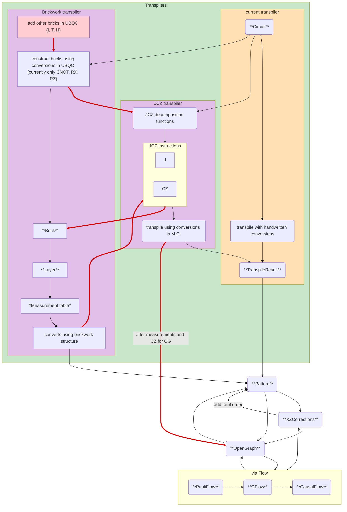

# Graphix Transpiler from Quantum Circuit to MBQC Patterns via J-∧z decomposition

This package provides a transpiler from quantum circuits to MBQC
(Measurement-Based Quantum Computing) patterns via J-∧z decomposition,
designed for use with the [Graphix library](https://github/TeamGraphix/graphix).

In the seminal paper [*The Measurement
Calculus*](https://arxiv.org/abs/0704.1263) by Danos, Kashefi, and
Panangaden (2007), circuit-to-pattern transpilation leverages the
universality of the gate set consisting of 𝔍(α) and ∧Z. This package
implements that transpilation mehtod in a straightforward and
principled way.

Compared to the existing transpilation procedure in Graphix, this
implementation is more naive but also more transparent:

- The code closely follows the structure described in the literature,
  making it easier to follow and verify for correctness.

- The resulting MBQC patterns are simple to understand and predict.

- Further optimization is possible via standard techniques such as
  Pauli pre-simulation, and space or depth minimization.

Todo:
 - [ ] Correct functionality with CCX gate
 - [ ] Set up for direct and OG/flow generation

Functionality relative to the rest of Graphix: 

